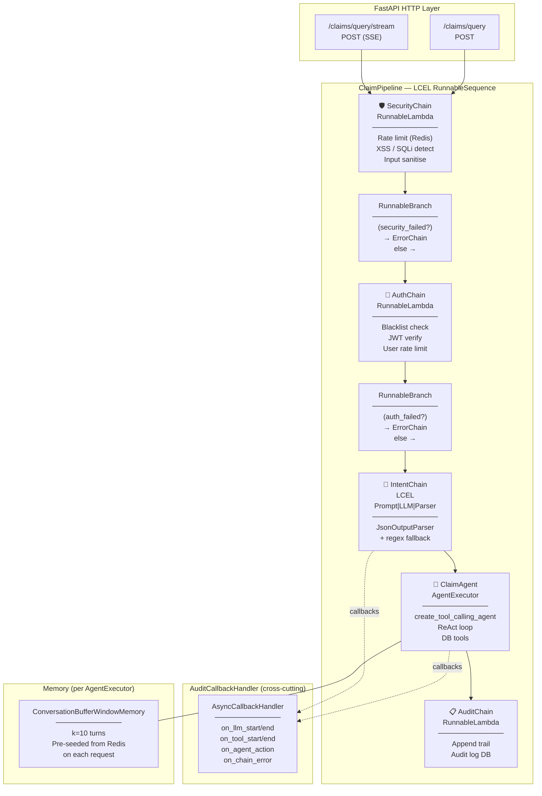

# LangChain-Only: Capabilities & Challenges

## Architecture Overview



---

## Full LCEL Import Reference

```python
# ── Core Runnables ──────────────────────────────────────────────────────────
from langchain_core.runnables import (
    Runnable,              # base type for all LCEL components
    RunnableSequence,      # implicit via | operator
    RunnableParallel,      # run multiple runnables on same input concurrently
    RunnableBranch,        # conditional routing (if/elif/else)
    RunnableLambda,        # wrap any sync or async Python function
    RunnablePassthrough,   # forward input unchanged (useful in RunnableParallel)
    RunnableConfig,        # pass callbacks, tags, metadata per invocation
)
from langchain_core.runnables.history import RunnableWithMessageHistory

# ── Messages ─────────────────────────────────────────────────────────────────
from langchain_core.messages import (
    BaseMessage, HumanMessage, AIMessage,
    SystemMessage, ToolMessage, FunctionMessage,
)

# ── Prompts ───────────────────────────────────────────────────────────────────
from langchain_core.prompts import (
    ChatPromptTemplate,
    MessagesPlaceholder,
    PromptTemplate,
    HumanMessagePromptTemplate,
    SystemMessagePromptTemplate,
)

# ── Output Parsers ────────────────────────────────────────────────────────────
from langchain_core.output_parsers import (
    StrOutputParser,
    JsonOutputParser,
    PydanticOutputParser,
    BaseOutputParser,
)

# ── Tools ─────────────────────────────────────────────────────────────────────
from langchain_core.tools import BaseTool, StructuredTool, tool

# ── Callbacks ─────────────────────────────────────────────────────────────────
from langchain_core.callbacks import (
    AsyncCallbackHandler,
    BaseCallbackHandler,
    CallbackManagerForChainRun,
)

# ── Chat History ──────────────────────────────────────────────────────────────
from langchain_core.chat_history import BaseChatMessageHistory
from langchain_community.chat_message_histories import RedisChatMessageHistory

# ── Agents ────────────────────────────────────────────────────────────────────
from langchain.agents import (
    create_react_agent,           # classic ReAct (text scratchpad)
    create_tool_calling_agent,    # modern function-calling agent
    create_json_chat_agent,       # for models without native tool calling
    AgentExecutor,                # executor wrapping any agent + tools
)

# ── Memory ────────────────────────────────────────────────────────────────────
from langchain.memory import (
    ConversationBufferMemory,        # unbounded (dev only)
    ConversationBufferWindowMemory,  # last k turns
    ConversationSummaryBufferMemory, # LLM-summarises old turns
    ConversationTokenBufferMemory,   # token-budget window
)

# ── LLM ───────────────────────────────────────────────────────────────────────
from langchain_core.language_models import BaseChatModel
from langchain_openai import ChatOpenAI   # generic OpenAI-compatible endpoint
```

---

## Capability vs Challenge Matrix

| Feature | LangChain Capability | Challenge / Limitation |
|---------|---------------------|----------------------|
| **Chaining** | `\|` operator chains any Runnables into a `RunnableSequence` | Chain is a static DAG — no cycles without Python loops |
| **Conditional routing** | `RunnableBranch` for if/else routing | Nested branches become deeply indented; no visual graph |
| **Parallel execution** | `RunnableParallel` runs runnables concurrently on the same input | Accidental parallel LLM calls double token cost |
| **Fallback** | `.with_fallbacks([alt])` on any Runnable | Catches ALL exceptions, not just specific parse errors |
| **Retry** | `.with_retry(stop_after_attempt=3)` | Retries the entire lambda, not just the failing sub-step |
| **Streaming** | `astream_events(version="v2")` for per-token streaming | Streaming across a RunnableBranch is opaque to the client |
| **Callbacks** | `AsyncCallbackHandler` fires on every LLM/tool/chain event | Cannot modify chain output from inside a callback |
| **Memory** | `ConversationBufferWindowMemory`, `SummaryBufferMemory` | Per-`AgentExecutor` — must manually stitch between agents |
| **Persistent history** | `RedisChatMessageHistory` + `RunnableWithMessageHistory` | Sync under the hood; needs custom async wrapper for true async |
| **Input validation** | Pydantic `args_schema` on `BaseTool` | No schema enforcement between pipeline steps — dict keys can drift |
| **Error propagation** | Encode errors in context dict or use `.with_fallbacks()` | An unhandled exception inside a `RunnableLambda` kills the pipeline |
| **Debugging** | Verbose callbacks + structlog | No `draw_mermaid()` equivalent; you read code to understand flow |
| **Checkpointing** | Manual Redis session save/load | No mid-execution resume after process crash |
| **State management** | Shared context dict passed through pipeline | No TypedDict enforcement; key collisions are runtime errors |
| **Multi-agent memory sharing** | Manual pre-seeding of each AgentExecutor's memory | No shared state graph between agents |
| **Token budget** | `ConversationTokenBufferMemory` | Summarisation adds latency + extra LLM cost per turn |

---

## When to Choose LangChain-Only vs LangGraph

```
┌─────────────────────────────────────────┬─────────────────────────────────┐
│ Choose LangChain-Only when...           │ Choose LangGraph when...        │
├─────────────────────────────────────────┼─────────────────────────────────┤
│ Simple linear pipeline (A→B→C)          │ Complex routing (many conditions)│
│ Single agent with tools                 │ Multiple coordinated agents      │
│ Stateless request/response              │ Long-running, resumable sessions │
│ Token streaming is primary feature      │ Mid-execution error recovery     │
│ Team familiar with functional style     │ Visual graph debugging needed    │
│ Prototype / MVP                         │ Production multi-agent systems   │
│ Minimal dependencies preferred          │ Typed state machine required     │
└─────────────────────────────────────────┴─────────────────────────────────┘
```

---

## Data Flow Diagram (LangChain-Only)

```
HTTP POST /claims/query
        │
        ▼
ClaimPipeline.run()
        │
        ▼ (ainvoke with AuditCallbackHandler)
┌───────────────────────────────────────────────────────┐
│  RunnableSequence (via |)                             │
│                                                       │
│  1. SecurityChain (RunnableLambda)                    │
│     ├─ Redis ZRANGEBYSCORE → sliding-window count     │
│     └─ InputSanitizer → XSS / SQLi patterns          │
│                                                       │
│  2. RunnableBranch ← security_failed(ctx)?            │
│     ├─ TRUE  → ErrorChain → return error context      │
│     └─ FALSE →                                        │
│         AuthChain (RunnableLambda + .with_retry())    │
│         ├─ Redis GET revoked_token:...                │
│         ├─ JWTManager.verify_token()                  │
│         └─ RateLimiter.check(user_id, tier="user")    │
│                                                       │
│         RunnableBranch ← auth_failed(ctx)?            │
│         ├─ TRUE  → ErrorChain                         │
│         └─ FALSE →                                    │
│             IntentChain (LCEL)                        │
│             ChatPromptTemplate | ChatOpenAI           │
│                  | JsonOutputParser                   │
│                  | .with_fallbacks([regex_chain])     │
│             → enriches ctx with intent_ctx            │
│                                                       │
│             ClaimAgentRunner.run() (RunnableLambda)   │
│             └─ AgentExecutor                          │
│                 (create_tool_calling_agent)            │
│                 ├─ think: which tool to call?         │
│                 ├─ call: get_claims_by_user(user_id)  │
│                 ├─ observe: [{claim_number, status}]  │
│                 ├─ call: summarize_claim(data)        │
│                 └─ answer: natural language response  │
│                                                       │
│  3. AuditChain (RunnableLambda)                       │
│     └─ Append to audit_trail, DB audit_logs INSERT    │
│                                                       │
└───────────────────────────────────────────────────────┘
        │
        ▼
 HTTP JSON Response
 {response, session_id, intent, is_authenticated}
```
