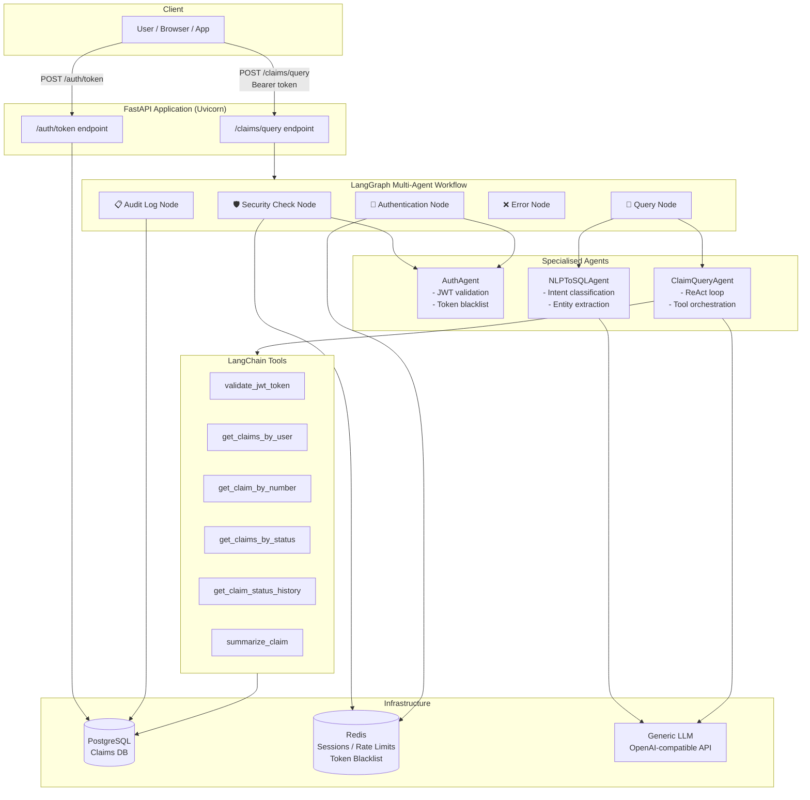
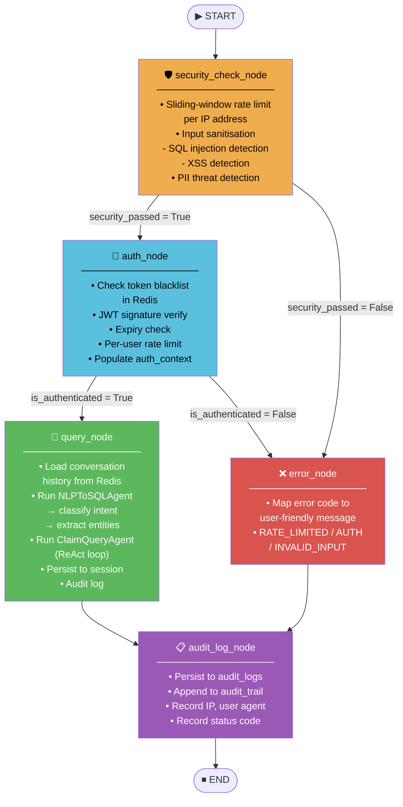
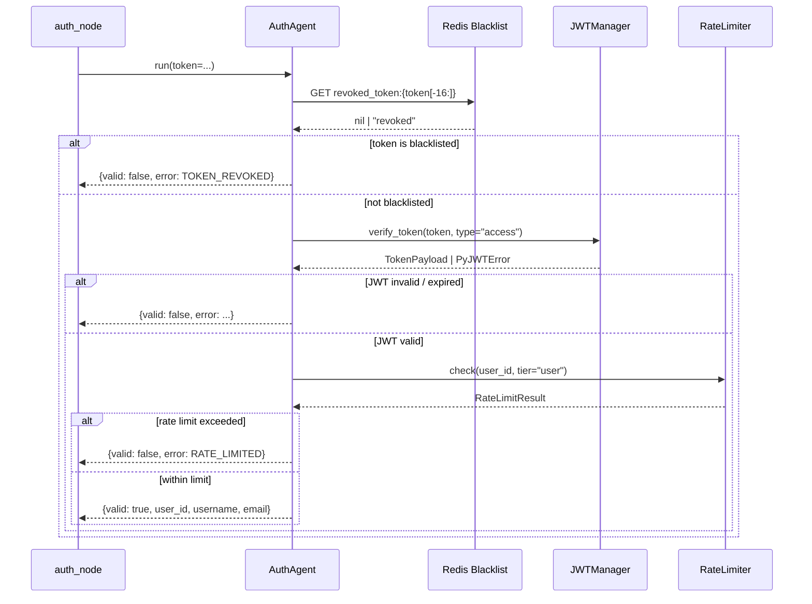
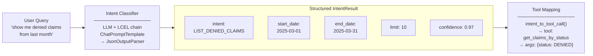
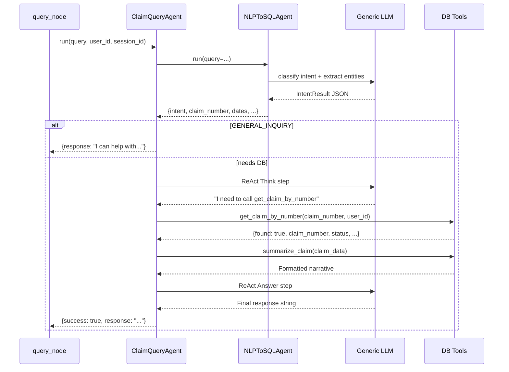
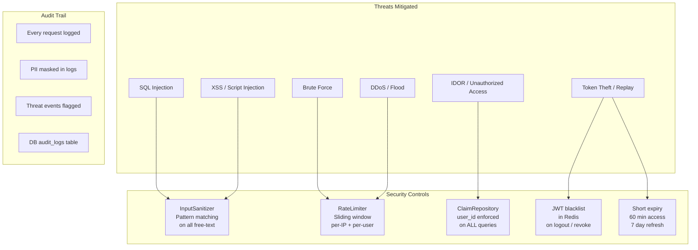
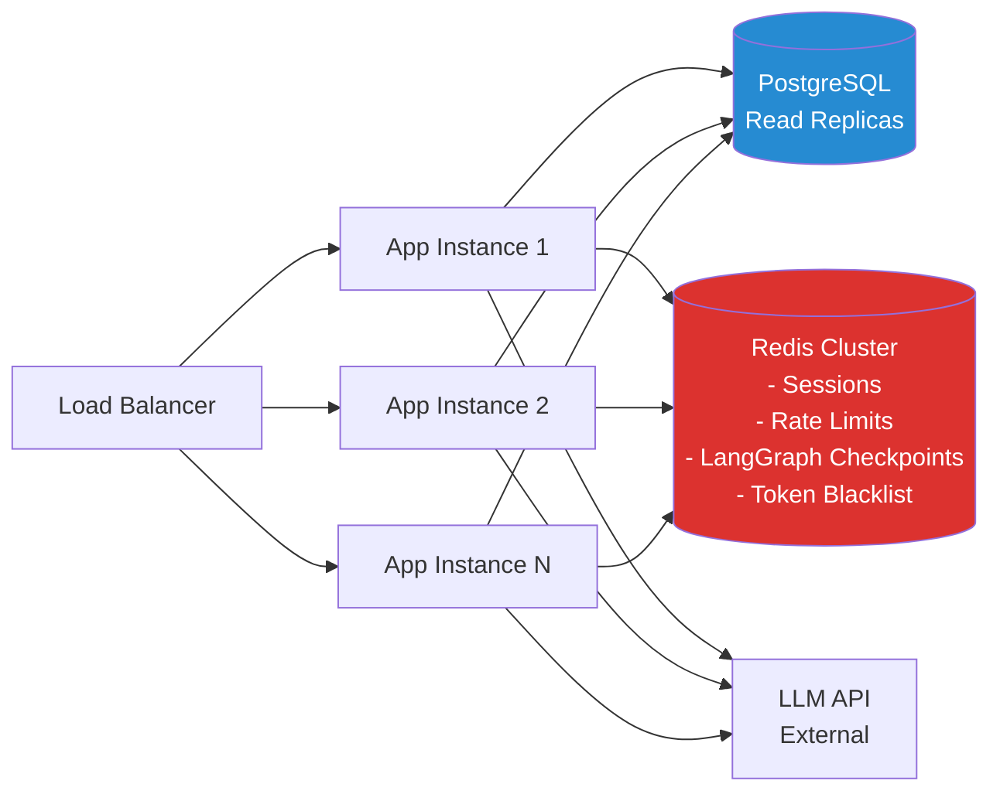

# Multi-Agent Claim Status — Flow Diagrams

## 1. High-Level System Architecture

---

## 2. LangGraph Node Flow

---

## 3. Agent Internal Flows

### 3a. Authentication Agent

### 3b. NLP → Intent Agent

### 3c. Claim Query Agent (ReAct Loop)

---

## 4. Security Architecture

---

## 5. Horizontal Scaling Strategy

Stateless app instances share all mutable state through Redis and PostgreSQL,
enabling zero-downtime rolling deployments and true horizontal scaling.
